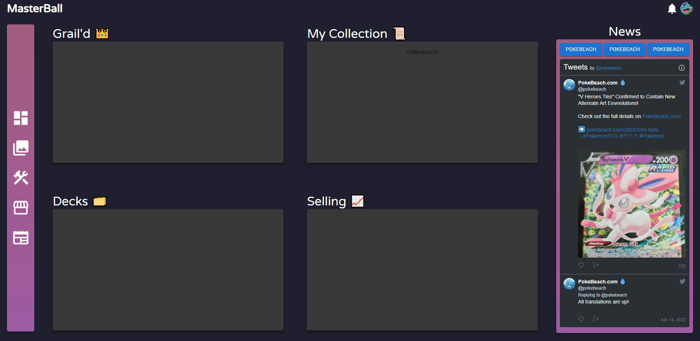

# MasterBall

## Dashboard

(This is currently still in the very early stages and is subject to change)

## Description
A Pokemon TCG Dashboard project for tracking my personal collection, most wanted cards, decks, and buy/sell list. 

This is an evolution of my previous project, Eevee.

## Tech-Stack
- MasterBall-Backend:
    - Django
    - SQLite3
- MasterBall-Frontend:
    - React w/Typescript

## My Progress
My progress will be tracked at the following Trello Kanban Board: https://trello.com/b/B597Md6Y/masterball
